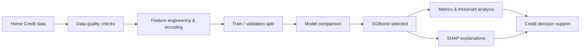

# Credit Default Risk Prediction with Explainable Machine Learning

> A machine-learning project for predicting credit default risk using the **Home Credit Default Risk** dataset, with explainable decisions through SHAP.


## Business problem

Financial institutions need to identify applicants who may default while avoiding unnecessary rejection of creditworthy customers. This project compares classification models on an imbalanced credit-risk dataset, then uses SHAP to make model decisions interpretable at both portfolio and individual-applicant levels.

## Project objectives

- Predict the probability that a customer will default on a loan.
- Compare traditional, ensemble, and neural-network classifiers using ROC-AUC, Precision, Recall, and F1-score.
- Address class imbalance with model class weights.
- Explain the selected model with SHAP global feature importance and local applicant-level explanations.
- Translate prediction probabilities into a decision-support workflow for credit review.

## Dataset

- **Source:** [Home Credit Default Risk](https://www.kaggle.com/competitions/home-credit-default-risk)
- **Primary file:** `application_train.csv`
- **Target:** `TARGET` (`1` = payment difficulty/default risk; `0` = no payment difficulty)

The raw dataset is not included in this repository because of its size and licensing. Download it from Kaggle and store it locally under `data/raw/`.

## Methodology



The original study evaluated Logistic Regression, Decision Tree, SVM, KNN, Random Forest, LightGBM, CatBoost, XGBoost, MLP, and Naive Bayes. The original notebooks used class weighting for the tree-based models and under-sampling for KNN; they did **not** use SMOTE. This repository's reproducible pipeline starts with Logistic Regression, Random Forest, and XGBoost, then can be extended with the remaining models.

## Results from the project report

| Selected model | ROC-AUC | Precision | Recall | F1-score |
|---|---:|---:|---:|---:|
| XGBoost | 0.7628 | 0.2639 | 0.3889 | 0.3141 |

XGBoost provided the strongest balance between identifying risky borrowers and limiting false positives in this experiment. CatBoost was also competitive (ROC-AUC: 0.7606; F1-score: 0.2922).

### Key insights

- External credit-source variables (`EXT_SOURCE_*`) were the most influential risk signals.
- Larger loan and goods-price amounts (`AMT_CREDIT`, `AMT_GOODS_PRICE`) contributed meaningfully to model risk estimates.
- SHAP made it possible to explain why an individual application was flagged, supporting a more transparent credit-review process.

> Metrics above reproduce the values reported in the course report. Re-running the pipeline may produce different scores because package versions, feature preprocessing, split definitions, and hyperparameters affect model results.

## Repository structure

```text
.
├── data/
│   ├── raw/                 # Kaggle files (ignored by Git)
│   └── processed/           # Model-ready datasets (ignored by Git)
├── notebooks/               # EDA, experiments, SHAP analysis
├── src/                     # Reusable preprocessing/training code
├── models/                  # Serialized models (ignored by Git)
├── reports/
│   └── figures/             # Exported charts and SHAP plots
├── docs/
│   └── PROJECT_STATUS.md    # Reproducibility roadmap
├── IS403_Q13.pdf            # Original Vietnamese course report
├── requirements.txt
└── README.md
```

## Quick start

```bash
git clone https://github.com/TrungPham233/IS403.Q13.git
cd IS403.Q13
python -m venv .venv
.venv\\Scripts\\activate       # Windows PowerShell
pip install -r requirements.txt
```

Download the Home Credit data from Kaggle, then place `application_train.csv` in `data/raw/`. The planned run order is:

```bash
# Start with a smaller sample to confirm that the environment works.
python -m src.train --data data/raw/application_train.csv --sample-size 50000

# Train on the full dataset. This can take substantial time and memory.
python -m src.train --data data/raw/application_train.csv
```

The command writes model files and `model_metrics.csv` to `artifacts/`, which is ignored by Git. Use the code under `src/` as the clean, local replacement for the original Colab/Google Drive-dependent experiment files.

## Limitations and responsible use

- This is an academic decision-support project, not a production credit-scoring system.
- The reported dataset may not represent current applicants or a Vietnamese lending portfolio.
- A deployment would require calibration, threshold selection based on financial cost, fairness/bias testing, monitoring, privacy controls, and human review.

## Team

- Đỗ Xuân Tú
- Phạm Đức Trung
- Phan Đức Trí
- Trần Minh Triết
- Trần Duy Trường

## Documentation

- [Original project report (Vietnamese)](IS403_Q13.pdf)
- [Repository status and contribution roadmap](docs/PROJECT_STATUS.md)
